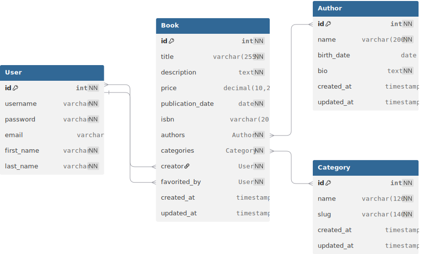

# 📚 Libra Django

A simple **Django** web app for managing a small library system.

### ✨ Features (current phase)
- Add, edit, and delete books
- Manage authors and categories
- Search and filter books by title, author, price, or publication date
- Bulk delete after filtering
- Favorite books per user
- Admin panel for data management

---

## 🗺️ ERD

---

### ⚙️ Tech Stack
- Python 3.x
- Django 5.x
- SQLite (development)

---

### 🚧 Development Status
Core models and admin panel registered.  
Next steps: build API endpoints and basic views.
